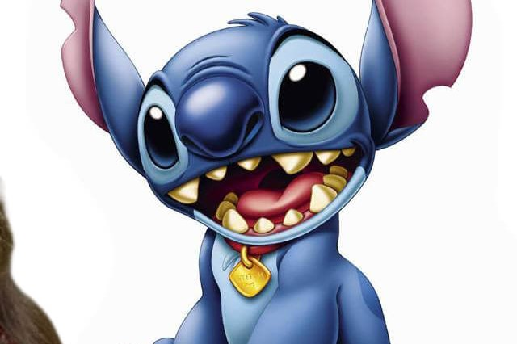
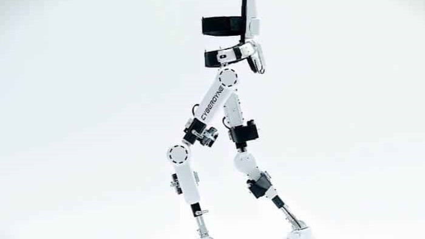

<h1 align="center">
  <p align="center">Meu Portal de Noticias</p>
  
</h1>
<div style="display: inline_block"><br>
  <div align="center">
  
  
  </div>
</div>

<h3> Sobre o Projeto </h3>
<p>Este é um projeto desenvolvido durante o quarto módulo do curso de CSS oferecido pela EBAC, onde criamos uma página de notícias utilizando apenas HTML e CSS. O exercício exigiu a aplicação de diversos conceitos de design e layout, como posicionamento de elementos, uso de cores, tipografia e organização de conteúdo. O projeto permitiu consolidar os conhecimentos adquiridos nas aulas e desenvolver habilidades em HTML e CSS.</p>

<h3> Pré Visualização </h3>

<p><i> Tela 1 - Esporte </i>


<p><i> Tela 2 - Economia </i>
</p>

<p><i> Tela 3 - Entretenimento </i>
</p>

<p><i> Tela 4 - Tecnologia </i>
</p>


<br></br>

<h3>Contatos</h3>
<div style="display: inline_block">
 <a href="https://instagram.com/fde.95" target="_blank"></a>
 <a href = "mailto:fdespinoza95@gmail.com"></a>
 <a href="https://www.linkedin.com/in/fde95" target="_blank"></a> 
</div>

<br></br>

<h3>Código Completo</h3>

<h4>HTML</h4>

```xml
<!DOCTYPE html>
<html lang="pt-BR">
  <head>
    <meta charset="UTF-8" />
    <meta http-equiv="X-UA-Compatible" content="IE=edge" />
    <meta name="viewport" content="width=device-width, initial-scale=1.0" />
    <link rel="preconnect" href="https://fonts.googleapis.com">
    <link rel="preconnect" href="https://fonts.gstatic.com" crossorigin>
    <link href="https://fonts.googleapis.com/css2?family=Anton&display=swap" rel="stylesheet">
    <link rel="preconnect" href="https://fonts.googleapis.com">
    <link rel="preconnect" href="https://fonts.gstatic.com" crossorigin>
    <link href="https://fonts.googleapis.com/css2?family=Catamaran&display=swap" rel="stylesheet">
    <title>Meu portal de notícias</title>
    <link rel="stylesheet" href="./main.css" />
  </head>
  <body>
    <header>
      <div class="container">
        <h1>Meu portal de notícias</h1>
        <nav>
          <ul>
            <li>
              <a href="#sports" title="Ir para a seção de esportes">Esportes</a>
            </li>
            <li>
              <a href="#economy" title="Ir para a seção de notícias"
                >Economia</a
              >
            </li>
            <li>
              <a href="#entertainment" title="Ir para a seção de notícias"
                >Entretenimento</a
              >
            </li>
            <li>
              <a href="#tecnology" title="Ir para a seção de notícias"
                >Tecnologia</a
              >
            </li>
          </ul>
        </nav>
      </div>
    </header>
    <section id="sports">
      <div class="container">
        <h2>Esportes</h2>
        <div class="artigo">
          <article>
            
            <header>
              <time>13/07/2022 às 12:35</time>
            </header>
            <h3>Grande clássico na noite de hoje</h3>
            <p>
              Lorem ipsum dolor sit amet consectetur adipisicing elit. Tenetur
              consequuntur doloremque totam labore architecto. Corporis adipisci
              optio placeat quibusdam totam iure veritatis quam, ullam tenetur
              error? Laborum, modi itaque. Sunt.
            </p>
            <a href="#" title="Leia a notícia completa">Ler mais</a>
          </article>
          <article>
            
            <header>
              <time class="creation-date">13/07/2022 às 12:35</time>
            </header>
            <h3>Noite do Superbowl</h3>
            <p>
              Lorem ipsum dolor sit amet consectetur adipisicing elit. Tenetur
              consequuntur doloremque totam labore architecto. Corporis adipisci
              optio placeat quibusdam totam iure veritatis quam, ullam tenetur
              error? Laborum, modi itaque. Sunt.
            </p>
            <a href="#" title="Leia a notícia completa">Ler mais</a>
          </article>
          <article>
            
            <header>
              <time>13/07/2022 às 12:35</time>
            </header>
            <h3>Notícia sobre a NBA</h3>
            <p>
              Lorem ipsum dolor sit amet consectetur adipisicing elit. Tenetur
              consequuntur doloremque totam labore architecto. Corporis adipisci
              optio placeat quibusdam totam iure veritatis quam, ullam tenetur
              error? Laborum, modi itaque. Sunt.
            </p>
            <a href="#" title="Leia a notícia completa">Ler mais</a>
          </article>
          <article>
            
            <header>
              <time>13/07/2022 às 12:35</time>
            </header>
            <h3>Notícia sobre a NBA</h3>
            <p>
              Lorem ipsum dolor sit amet consectetur adipisicing elit. Tenetur
              consequuntur doloremque totam labore architecto. Corporis adipisci
              optio placeat quibusdam totam iure veritatis quam, ullam tenetur
              error? Laborum, modi itaque. Sunt.
            </p>
            <a href="#" title="Leia a notícia completa">Ler mais</a>
          </article>
        </div>
      </div>
    </section>
    <section id="economy">
      <div class="container">
        <h2>Economia</h2>
        <div class="artigo">
          <article>
            
            <header>
              <time>13/07/2022 às 12:35</time>
            </header>
            <h3>Dólar em alta de 0.50%</h3>
            <p>
              Lorem ipsum dolor sit amet consectetur adipisicing elit. Tenetur
              consequuntur doloremque totam labore architecto. Corporis adipisci
              optio placeat quibusdam totam iure veritatis quam, ullam tenetur
              error? Laborum, modi itaque. Sunt.
            </p>
            <a href="#" title="Leia a notícia completa">Ler mais</a>
          </article>
          <article>
            
            <header>
              <time>13/07/2022 às 12:35</time>
            </header>
            <h3>Euro em queda de 0.40%</h3>
            <p>
              Lorem ipsum dolor sit amet consectetur adipisicing elit. Tenetur
              consequuntur doloremque totam labore architecto. Corporis adipisci
              optio placeat quibusdam totam iure veritatis quam, ullam tenetur
              error? Laborum, modi itaque. Sunt.
            </p>
            <a href="#" title="Leia a notícia completa">Ler mais</a>
          </article>
          <article>
            
            <header>
              <time>13/07/2022 às 12:35</time>
            </header>
            <h3>Alta no preço do barril do petróleo</h3>
            <p>
              Lorem ipsum dolor sit amet consectetur adipisicing elit. Tenetur
              consequuntur doloremque totam labore architecto. Corporis adipisci
              optio placeat quibusdam totam iure veritatis quam, ullam tenetur
              error? Laborum, modi itaque. Sunt.
            </p>
            <a href="#" title="Leia a notícia completa">Ler mais</a>
          </article>
        </div>
      </div>
    </section>
    <!--COMEÇO DA PRIMEIRA NOVA SEÇÃO-->
    <section id="entertainment">
      <div class="container">
        <h2>Entretenimento</h2>
        <div class="artigo">
          <article>
            
            <header>
              <time>30/02/2023 às 08:55</time>
            </header>
            <h3>Keanu Reeves está tentando fazer Constantine 2, mas não pode garantir</h3>
            <p>
              Lorem ipsum dolor sit amet consectetur adipisicing elit. Tenetur
              consequuntur doloremque totam labore architecto. Corporis adipisci
              optio placeat quibusdam totam iure veritatis quam, ullam tenetur
              error? Laborum, modi itaque. Sunt.
            </p>
            <a href="#" title="Leia a notícia completa">Ler mais</a>
          </article>
          <article>
            
            <header>
              <time>31-03/2023 às 18:55</time>
            </header>
            <h3>Live Action de Lilo & Stitch define atriz para sua protagonista</h3>
            <p>
              Lorem ipsum dolor sit amet consectetur adipisicing elit. Tenetur
              consequuntur doloremque totam labore architecto. Corporis adipisci
              optio placeat quibusdam totam iure veritatis quam, ullam tenetur
              error? Laborum, modi itaque. Sunt.
            </p>
            <a href="#" title="Leia a notícia completa">Ler mais</a>
          </article>
          <article>
            
            <header>
              <time>13/07/2022 às 12:35</time>
            </header>
            <h3>O Auto da Compadecida 2 terá retorno de Fernanda Montenegro, diz jornalista</h3>
            <p>
              Lorem ipsum dolor sit amet consectetur adipisicing elit. Tenetur
              consequuntur doloremque totam labore architecto. Corporis adipisci
              optio placeat quibusdam totam iure veritatis quam, ullam tenetur
              error? Laborum, modi itaque. Sunt.
            </p>
            <a href="#" title="Leia a notícia completa">Ler mais</a>
          </article>
        </div>
      </div>
    </section>
    <!--FIM DA PRIMEIRA NOVA SEÇÃO-->
    <!--COMEÇO DA SEGUNDA NOVA SEÇÃO-->
        <section id="tecnology">
          <div class="container">
            <h2>Tecnologia</h2>
            <div class="artigo">
              <article>
                
                <header>
                  <time>03/04/2022 às 12:35</time>
                </header>
                <h3>Itália bloqueia ChatGPT provisioriamente</h3>
                <p>
                  Lorem ipsum dolor sit amet consectetur adipisicing elit. Tenetur
                  consequuntur doloremque totam labore architecto. Corporis adipisci
                  optio placeat quibusdam totam iure veritatis quam, ullam tenetur
                  error? Laborum, modi itaque. Sunt.
                </p>
                <a href="#" title="Leia a notícia completa">Ler mais</a>
              </article>
              <article>
                
                <header>
                  <time>13/01/2023 às 19:21</time>
                </header>
                <h3>Como IA da NASA prevê tempestades solares?</h3>
                <p>
                  Lorem ipsum dolor sit amet consectetur adipisicing elit. Tenetur
                  consequuntur doloremque totam labore architecto. Corporis adipisci
                  optio placeat quibusdam totam iure veritatis quam, ullam tenetur
                  error? Laborum, modi itaque. Sunt.
                </p>
                <a href="#" title="Leia a notícia completa">Ler mais</a>
              </article>
              <article>
                
                <header>
                  <time>26/02/2022 às 04:12</time>
                </header>
                <h3>Exoesqueleto com IA promete a “força de um cavalo” para o usuário</h3>
                <p>
                  Lorem ipsum dolor sit amet consectetur adipisicing elit. Tenetur
                  consequuntur doloremque totam labore architecto. Corporis adipisci
                  optio placeat quibusdam totam iure veritatis quam, ullam tenetur
                  error? Laborum, modi itaque. Sunt.
                </p>
                <a href="#" title="Leia a notícia completa">Ler mais</a>
              </article>
            </div>
          </div>
        </section>
    <!--FIM DA SEGUNDA NOVA SEÇÃO-->
  </body>
</html>
```

<br></br>

<h4>CSS</h4>

```css
{
 *{
  box-sizing: border-box;
  margin: 0;
  padding: 0;
}

body > header{
    background-color: #2f3640;
    padding: 16px 0;
    color: #f5f6fa;
    font-family: 'Anton', sans-serif;
}

header .container{
    display: flex;
    align-items: center;
    justify-content: space-between
}

header li{
    display: inline;
    font-family: sans-serif, arial, helvetica;
    font-weight: bold;
    margin-left: 16px;
}

header li a{
    color: #f5f6fa ;
    text-decoration: none;
    font-family: 'Anton', sans-serif;
    font-weight: 500;
}

header li a:hover{
    text-decoration: underline;
}

.container{
    width: 1366px;
    margin: 0 auto;
}

.artigo{
    display: flex;
    flex-wrap: wrap;
    justify-content: space-between;
}

.artigo article img{
    /*height: 180px;*/
    width: 100%;
}

.artigo article{
    width: 30%;
}

section{
    padding: 16px 0;
}

section h2,
.artigo article{
    margin-bottom: 16px;
}

.artigo article h3{
    margin-top: 8px;
    margin-bottom: 8px;
}

.artigo article a{
    background-color: blue;
    color: #fff;
    padding: 8px;
    display: inline-block;
    text-decoration: none;
    font-weight: bold;
    margin-top: 8px;
}

.artigo article a:hover{
    text-decoration: underline
}

.artigo article p,
.artigo article a{
    font-family: sans-serif, arial, helvetica;
}

.artigo article h3{
    font-size: 24px;
    font-family: 'Anton', sans-serif;
}

.artigo article p, 
.artigo article a,
.artigo article header{
    font-family: 'Catamaran', sans-serif;
}

section h2{
    font-size: 32px;
    font-family: 'Anton', sans-serif;
}

#sports {
    background-color: rgba(0, 255, 0, 10%);
}

#sports .artigo article a{
    background-color: rgba(0, 173, 0, 0.851);
}

#economy {
    background-color: #f8f59f;
}

#economy .artigo article a{
    background-color: #ff9f1a ;
}

#entertainment {
    background-color: #9fc9f8;
}

#entertainment .artigo article a{
    background-color: #1a5fff ;
}

#tecnology {
    background-color: #f89fe8;
}

#tecnology .artigo article a{
    background-color: #fb1aff ;
}
```
